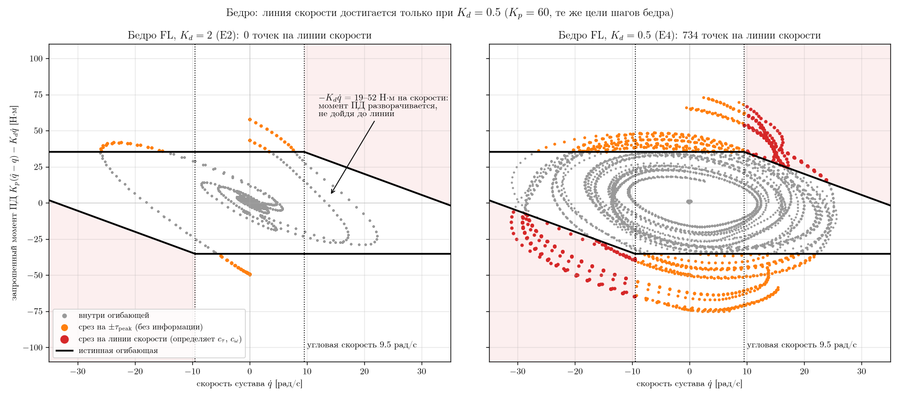
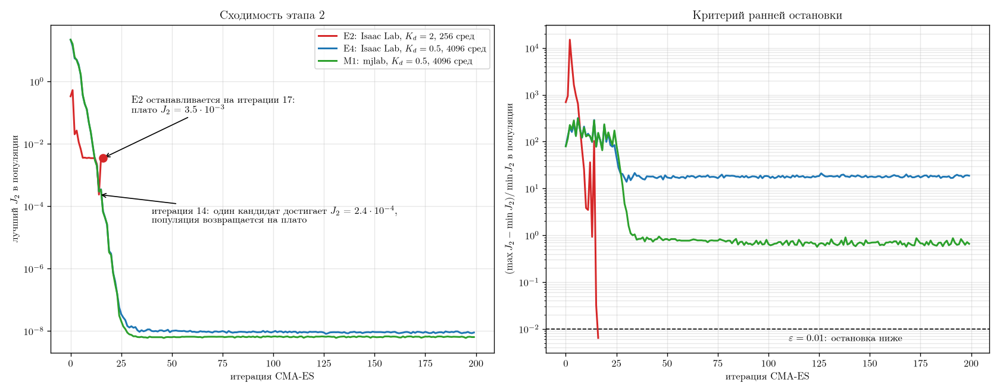
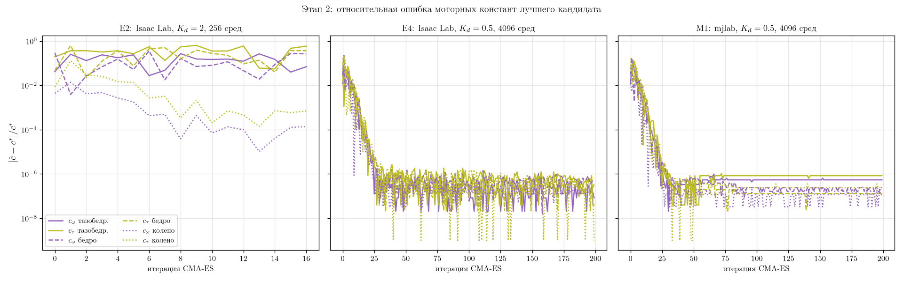

# PACE + кривая «момент–скорость»: идентификация предела привода по данным в воздухе

Реализация PACE ([Bjelonic et al., 2025](https://arxiv.org/abs/2509.06342)) в
[mjlab](https://github.com/mujocolab/mjlab) (MuJoCo Warp) с добавленным вторым этапом — идентификацией кривой
«момент–скорость» (огибающей обратной ЭДС) приводов Unitree Aliengo. Парный репозиторий —
[форк PACE на Isaac Lab 3](https://github.com/kittvnebluda/pace-sim2real) (Newton / MuJoCo Warp).

Полный текст проектного задания (мотивация, обзор, постановка, метрики): [docs/longread.pdf](docs/longread.pdf).
Журнал экспериментов, из которого взяты все числа ниже: [docs/EXPERIMENTS.md](docs/EXPERIMENTS.md).

## Кратко

- **Проблема.** В PACE и близких работах кривая «момент–скорость» берётся из спецификации или подгоняется
  феноменологически. Данные, по которым идентифицируется PACE (чирпы при низких коэффициентах регулятора), не выводят
  привод на эту кривую, и авторы PACE сами считают её плохо идентифицируемой по таким траекториям.
- **Гипотеза.** При возбуждении, выводящем запрошенный ПД-момент на линию обратной ЭДС, параметры кривой
  (по два эффективных коэффициента c_ω, c_τ на группу приводов) идентифицируемы по положениям суставов и оценке момента.
- **Что сделано.** PACE перенесён на Isaac Lab 3 и заново реализован в mjlab; в оба стека добавлен актуатор с
  идентифицируемой огибающей и второй этап CMA-ES на ступенчатых движениях.
- **Результат (синтетика).** Этап 1 восстанавливает параметры сустава на всех 12 суставах с относительной ошибкой
  < 2·10⁻⁵ (Isaac Lab) и < 5·10⁻⁶ (mjlab), задержку — точно. Этап 2 при K_d = 0.5 восстанавливает все 6 моторных
  констант с ошибкой < 10⁻⁶ в обоих стеках и в перекрёстных подгонках. При K_d = 2 насыщение есть, но бедро и
  тазобедренный сустав не идентифицируются: запрошенный момент упирается в полку ±τ_peak и не доходит до наклонной линии.
- **Чего пока нет.** Проверки на реальном Aliengo, шума в данных и обучения стратегии.

## Проблема и барьер

Реальный двигатель на высокой скорости выдаёт меньше момента из-за обратной ЭДС. Движения, которые в симуляции выходят
за кривую «момент–скорость», не воспроизводятся на роботе — и именно в предельных режимах (быстрый бег) это стоит
дороже всего. Примеры из литературы (подробнее — раздел 1 [проектного задания](docs/longread.pdf)):

- PACE: ANYmal D в симуляции разгонялся до 4 м/с, на роботе — только до 3 м/с; авторы связывают это с неучтённым
  ограничением тока батареи (Bjelonic et al., 2025).
- Spot: подбор трения и кривой «момент–скорость» с переобучением стратегии поднял скорость на железе с 3.8 до 5.2 м/с
  (Miller et al., 2025).
- KAIST Hound: учёт области работы двигателя при обучении дал 6.5 м/с на дорожке против 4.5 м/с без него, хотя в
  симуляции обе стратегии достигали 6.5 м/с (Shin et al., 2023).

**Открытая проблема:** ни в одной из рассмотренных работ кривая «момент–скорость» в виде физической модели (белый ящик)
не идентифицируется по данным — она либо из спецификации (Shin et al., 2023; Bjelonic et al., 2025), либо
феноменологическая (Miller et al., 2025; tanh у Sobanbabu et al., 2025). Для Aliengo спецификация двигателей и
передаточные числа не опубликованы, а в URDF производителя есть только не зависящий от скорости предел момента.

**Барьер:** PACE идентифицирует сустав по чирпам при низких K_p, K_d — безопасно, но привод при этом не выходит на
границу своих возможностей, поэтому параметры границы ненаблюдаемы. В эксперименте E2 ниже показано, что одного факта
насыщения недостаточно: нужно, чтобы запрошенный момент доходил именно до наклонной линии обратной ЭДС.

## Гипотеза

1. Если ступенчатые движения подвешенного робота с высоким K_p и малым K_d выводят запрошенный ПД-момент на линию
   обратной ЭДС, то параметры кривой «момент–скорость» идентифицируемы по положениям суставов и штатной оценке момента
   τ_est, без датчиков момента.
2. Стратегия, обученная с такой моделью привода, сокращает разрыв максимальной скорости бега «симуляция–реальность»
   не менее чем вдвое относительно базовой модели (PACE + не зависящий от скорости предел из URDF) без потери скорости
   на роботе.

Здесь проверена **только часть 1, и только на синтетических данных**. Часть 2 требует робота
(см. [Следующие шаги](#следующие-шаги)).

## Метод

Модель сустава PACE без изменений: инерция I_a, вязкое d и кулоновское τ_f трение, смещение энкодера q̃_b, задержка T_d.
Выход ПД-регулятора ограничивается огибающей двигателя постоянного тока, записанной в пространстве сустава с двумя
эффективными коэффициентами на группу приводов (hip, thigh, knee):

```
−V_bus ≤ c_τ·τ + c_ω·q̇ ≤ V_bus,     |τ| ≤ τ_peak
τ_stall = V_bus / c_τ,   q̇_max = V_bus / c_ω
τ_out = clip(τ_PD, τ⁻(q̇), τ⁺(q̇)), затем задержка T_d
```

V_bus = 27 В (номинал), τ_peak из URDF: 35.278 / 35.278 / 44.4 Н·м (hip / thigh / knee).

Подбор — CMA-ES в два этапа:

| Этап | Данные | Подбираются | Функционал |
| ---- | ------ | ----------- | ---------- |
| 1 (как в PACE) | чирп 0.1→10 Гц, 20 с, K_p 40 / K_d 2; огибающая не срабатывает ни на одном отсчёте | I_a, d, τ_f, q̃_b на сустав + общая задержка: 4·12 + 1 = 49 | 1/N Σ‖q − q_sim‖² |
| 2 (новый) | ступеньки, удержание 0.5 с, чередование знака, K_p 60 / K_d 0.5 (в E2 — K_d 2) | c_ω, c_τ на группу: 6 | J₂ = 1/N Σ‖q − q_sim‖² + λ/N Σ‖τ_est − τ_sim‖², λ = 1 |

Параметры этапа 1 на этапе 2 заморожены. Проверка — синтетическая: «робот» — та же модель Aliengo с известными
истинными параметрами, заметно отличающимися от начального приближения CMA-ES (середины границ).

<details>
<summary>Истинные значения, границы и начальное приближение</summary>

Этап 1:

| Параметр | Границы | Начальное | Истина |
| -------- | ------- | --------- | ------ |
| Armature I_a | 1e-4 – 0.1 | 0.050 | 0.02 |
| Вязкое трение d | 0 – 2 | 1.0 | 0.5 |
| Кулоновское трение τ_f | 0 – 1 | 0.5 | 0.2 |
| Смещение энкодера q̃_b | ±0.1 | 0.0 | 0.05 |
| Задержка (шаги по 2 мс) | 0 – 10 | 5.0 | 7 |

Этап 2 (c_ω [В·с/рад], c_τ [В/(Н·м)]):

| Группа | Границы c_ω | Начальное c_ω | Истина c_ω | Границы c_τ | Начальное c_τ | Истина c_τ | q̇_max / τ_stall | Угловая скорость |
| ------ | ----------- | ------------- | ---------- | ----------- | ------------- | ---------- | --------------- | ---------------- |
| hip   | 0.60–1.35 | 0.975 | 1.15 | 0.09–0.77 | 0.43 | 0.60 | 23.5 рад/с / 45 Н·м  | 5.1 рад/с  |
| thigh | 0.60–1.35 | 0.975 | 0.80 | 0.09–0.77 | 0.43 | 0.55 | 33.8 рад/с / 49 Н·м  | 9.5 рад/с  |
| knee  | 0.75–1.70 | 1.225 | 1.45 | 0.07–0.61 | 0.34 | 0.25 | 18.6 рад/с / 108 Н·м | 11.0 рад/с |

</details>

## Результаты

Обозначения прогонов: **E** — Isaac Lab 3 / Newton ([pace-sim2real](https://github.com/kittvnebluda/pace-sim2real)),
**M** — mjlab (этот репозиторий). Все прогоны — 4096 сред (кроме этапа 2 в E2: 256), 200 итераций CMA-ES, если не
указано иное. Подробности и пути к логам — в [docs/EXPERIMENTS.md](docs/EXPERIMENTS.md).

### Этап 1: параметры сустава (чирпы)

Максимальная относительная ошибка по 12 суставам, `mean_199.pt`:

| Параметр | Истина | E2 (Isaac Lab) | M1 (mjlab) |
| -------- | ------ | -------------- | ---------- |
| Armature | 0.02 | 5.8e-7 | 1.6e-7 |
| Вязкое трение | 0.5 | 7.2e-7 | 2.4e-7 |
| Кулоновское трение | 0.2 | 6.8e-6 | 3.0e-6 |
| Смещение энкодера | 0.05 | 1.7e-5 | 4.4e-6 |
| Задержка (шаги) | 7 | 7.5466 → 7 (точно) | 7.5141 → 7 (точно) |

Лучшая оценка: 1.33e-13 (E2), 6.5e-14 (M1). Кривая оценки M1 повторяет E2 (итерация 1: 0.037470 в обоих).
E1 (тот же этап 1, но с идеальным ПД-актуатором без огибающей) также восстановил все параметры с ошибкой < 0.05 %.

### Этап 2: кривая «момент–скорость» (ступеньки)

**E2, K_d = 2 — насыщение есть, идентифицируемости нет.** Остановка по критерию `epsilon` на 17-й итерации из 200,
лучший J₂ = 3.50e-3 при J₂ = 2.4e-9 в истинной точке:

| Группа | Истина c_ω / c_τ | Найдено c_ω / c_τ | Восстановлено |
| ------ | ---------------- | ----------------- | ------------- |
| hip   | 1.15 / 0.60 | 1.0703 / 0.2499 | нет |
| thigh | 0.80 / 0.55 | 1.0108 / 0.3490 | нет |
| knee  | 1.45 / 0.25 | 1.4502 / 0.2502 | да |

Почему: огибающая срабатывает на 3.5–8.3 % отсчётов каждого сустава, но почти всегда на полке ±τ_peak, которая от
c_ω, c_τ не зависит. Число отсчётов на наклонной линии (на сустав):

| Группа | На линии обратной ЭДС | На ±τ_peak |
| ------ | --------------------- | ---------- |
| hip   | FL, RL по 18; FR, RR 0 (5.6–6.9 рад/с) | 353–360 |
| thigh | **0 на всех ногах** | 764–833 |
| knee  | 173–235 (15.6–25.6 рад/с) | 307–325 |

Для бедра выше угловой скорости 9.5 рад/с D-член вычитает 19–52 Н·м (K_d·q̇ при K_d = 2), и запрошенный момент
«разворачивается», не дойдя до линии: ближайшая точка — 27.2 Н·м против 34.9 Н·м на линии при 9.8 рад/с.
J₂ по бедру плоский на уровне шума (~1e-9) в широкой области (τ_stall 50–82 Н·м, q̇_max 25–30 рад/с). У hip
36 точек в узкой полосе скоростей дают слабую идентифицируемость (минимум сетки в истине, но c_ω и c_τ размениваются
друг на друга). Колено, где линия достигается, восстановлено.



*Рис. 1. Запрошенный ПД-момент бедра FL на ступеньках при K_d = 2 (E2, слева) и K_d = 0.5 (E4, Isaac Lab, справа;
цели ступенек бедра те же) поверх истинной огибающей. Красные точки — отсчёты, срезанные наклонной линией обратной ЭДС:
только они несут информацию о c_ω, c_τ. При K_d = 2 таких точек нет.*

**K_d = 0.5 — все 6 констант восстановлены.** Количество отсчётов на линии на сустав (ступеньки внутри пределов
суставов): hip 384–476, thigh 734–747, knee 391–420 (против 0–18 / 0 / 173–235 при K_d = 2).
Максимальная относительная ошибка, `mean_199.pt`:

| Группа | Истина c_ω / c_τ | E3 (Isaac Lab)¹ | E4 (Isaac Lab) | M1 (mjlab) |
| ------ | ---------------- | --------------- | -------------- | ---------- |
| hip   | 1.15 / 0.60 | 2.3e-7 | 6.4e-7 | 8.3e-7 |
| thigh | 0.80 / 0.55 | 3.6e-7 | 5.1e-7 | 2.4e-7 |
| knee  | 1.45 / 0.25 | 4.8e-7 | 2.4e-7 | 2.4e-7 |
| лучший J₂ | | 8.4e-9 | 9.0e-9 | 6.4e-9 |

¹ E3 — первый прогон с K_d = 0.5; ступеньки в нём выходят за пределы hip и calf. Внутри одного стека это корректно,
но для сравнения стеков ступеньки перенесены внутрь пределов (E4, M1).



*Рис. 2. Слева: лучший J₂ в популяции по итерациям (лог-шкала). E2 выходит на плато 3.5·10⁻³ и останавливается
критерием `epsilon`; E4 и M1 спускаются до ~10⁻⁸ к ~30-й итерации. Справа: относительный разброс J₂ в популяции и
порог ε = 0.01. Ранняя остановка по разбросу ошибочна для этапа 2, где плато с ненулевым J₂ — обычное дело.*



*Рис. 3. Относительная ошибка c_ω, c_τ лучшего кандидата по итерациям для E2, E4 и M1.*

### Совпадение стеков

mjlab 1.6.0 и Isaac Lab 3 (Newton), оба MuJoCo Warp 3.11.0, `dt = 0.002`, `implicitfast`, одинаковые MJCF, истина,
возбуждение и модель актуатора:

| Запись | Макс. разница положения | Разница момента |
| ------ | ----------------------- | --------------- |
| Чирп (K_p 40 / K_d 2), 20 с | 4.8e-7 рад (СКО 2e-8 – 8e-8) | СКО 1e-6 – 4e-6 Н·м |
| Ступеньки внутри пределов (K_p 60 / K_d 0.5) | 2.7e-6 рад | макс. 8.4e-4 Н·м |
| Ступеньки с выходом за пределы (данные E3) | совпадают до 2.09 с, затем СКО 0.02–0.13 рад | СКО 1–7 Н·м |

Расхождение в последней строке вызвано мягкими ограничениями суставов, которые стеки параметризуют по-разному
(Newton масштабирует `solref` предела по `dof_invweight0`), — это вне модели PACE. Поэтому ступеньки должны оставаться
внутри пределов суставов.

### Перекрёстная проверка 2×2

Данные записаны в одном стеке, подгонка — в каждом из двух; ступеньки внутри пределов, K_d = 0.5.
Максимальная относительная ошибка (этап 1 / этап 2):

| | подгонка в Isaac Lab | подгонка в mjlab |
| --- | --- | --- |
| **данные из Isaac Lab** | E2 + E4: < 2e-5 / < 7e-7 | M2: < 4e-6 / < 6e-7 |
| **данные из mjlab** | M3: < 2e-5 / < 6e-7 | M1: < 5e-6 / < 1e-6 |

Каждый стек восстанавливает параметры по данным другого стека так же, как по своим (ошибка смещения энкодера:
Isaac Lab 1.7e-5 / 1.5e-5 на своих / чужих данных, mjlab 4.4e-6 / 4.0e-6). Для sim-to-sim стеки взаимозаменяемы.

## Ограничения

Результаты выше показывают **идентифицируемость в принципе**, а не точность на реальном роботе:

- **Синтетика без шума.** Шума энкодеров, квантования и выбросов в данных нет; ошибки 10⁻⁶–10⁻⁷ — это точность
  оптимизатора и float, а не оценка ожидаемой точности на железе.
- **τ_est совпадает с моментом симулятора.** На Aliengo оценка момента (поле `tauEst` SDK), по-видимому, линейна по току
  и может завышать момент вблизи τ_peak из-за насыщения магнитопровода; её запаздывание и шум не моделировались.
- **Истинная модель из того же класса, что и подбираемая.** Невязка модели (СДПМ с векторным управлением вместо
  двигателя постоянного тока, просадка V_bus под нагрузкой, нагрев обмоток, ограничение тока батареи) не проверялась.
- V_bus принят номинальным (27 В): наблюдаемы τ_stall и q̇_max, а c_τ, c_ω масштабируются пропорционально ошибке в V_bus.
- Ступеньки должны оставаться внутри пределов суставов (см. совпадение стеков).
- Критерий остановки `epsilon` (разброс < 1 %) на синтетике этапа 1 не срабатывает никогда, а на этапе 2 может
  остановить подгонку на плато (E2).
- Часть 2 гипотезы (разрыв скорости бега) не проверялась.

## Следующие шаги

1. Устойчивость к шуму и запаздыванию τ_est и к невязке модели на синтетике.
2. Сбор чирпов и ступенек на подвешенном Aliengo, сравнение с базовой моделью по метрикам e_q, e_τ на отложенной
   выборке (раздел 2.2 проектного задания).
3. Обучение стратегий с идентифицированной и базовой моделью, измерение разрыва максимальной скорости бега.
4. Замена критерия остановки этапа 2 (например, по отсутствию улучшения J₂ за k итераций).
5. Поиск наиболее информативного возбуждения; учёт напряжения батареи и нагрева обмоток.

## Воспроизведение

Версии: Python ≥ 3.12, mjlab 1.6.0, MuJoCo Warp 3.11.0, cmaes 0.13.1, PyTorch (CUDA 13.0 или CPU), менеджер пакетов
[uv](https://docs.astral.sh/uv/). Точные версии зависимостей зафиксированы в `uv.lock`.

```sh
git clone https://github.com/kittvnebluda/pace-mjlab.git
cd pace-mjlab
make sync          # uv sync --extra cu130 --group dev  (CUDA 13.0)
# или
make sync-cpu      # uv sync --extra cpu --group dev

# 1. Синтетические данные с истинными параметрами (data/aliengo_sim/)
uv run collect-data --excitation chirp     # чирп, K_p 40 / K_d 2
uv run collect-data --excitation step      # ступеньки внутри пределов, K_p 60 / K_d 0.5

# 2. Этап 1 (4096 сред, 200 итераций) → logs/pace/aliengo_sim/<время>/
uv run fit --stage 1

# 3. Этап 2 с замороженным этапом 1 → logs/pace/aliengo_sim/stage2/<время>/
uv run fit --stage 2 --stage1-run logs/pace/aliengo_sim/<время>

# 4. Найденные параметры против истины
uv run show-ident --stage 2
```

Параметры CMA-ES задаются флагами `tyro`, например `--num-envs 256`, `--cmaes.max-iteration 100`,
`--cmaes.epsilon None`; список — `uv run fit --help`. Чужие данные (например, записанные в Isaac Lab для M2) —
через `--data <файл.pt>`.

**Время и железо.** Прогоны выполнены на одной NVIDIA GeForce RTX 5060 Ti (16 ГБ) с Intel Core Ultra 7 155H.
Этап 1 (M1) — ~22 с на итерацию, ~75 мин; этап 2 (M1) — ~23 с на итерацию, ~77 мин; узкое место — CPU.
Два прогона одновременно на одной GPU — ~38–43 с на итерацию каждый. Синтетический прогон всегда доходит до
200 итераций: критерий `epsilon` на данных без шума не срабатывает. Режим `sync-cpu` устанавливает CPU-сборку PyTorch;
время подгонки на CPU не измерялось.

Тесты: `make test`.

Isaac Lab-часть (E1–E4, M3) воспроизводится в [pace-sim2real](https://github.com/kittvnebluda/pace-sim2real),
задача `Isaac-Pace-Aliengo-v0`, `physics=newton_mjwarp`; см. README того репозитория.

## Источники

1. Bjelonic F., Tischhauser F., Hutter M. Towards bridging the gap: Systematic sim-to-real transfer for diverse legged
   robots. [arXiv:2509.06342](https://arxiv.org/abs/2509.06342), 2025. Код:
   [leggedrobotics/pace-sim2real](https://github.com/leggedrobotics/pace-sim2real).
2. Shin Y.-H., Song T.-G., Ji G., Park H.-W. Actuator-constrained reinforcement learning for high-speed quadrupedal
   locomotion. [arXiv:2312.17507](https://arxiv.org/abs/2312.17507), 2023.
3. Miller A. J., Yu F., Brauckmann M., Farshidian F. High-performance reinforcement learning on Spot: Optimizing
   simulation parameters with distributional measures. ICRA 2025. [arXiv:2504.17857](https://arxiv.org/abs/2504.17857).
4. Sobanbabu N., He G., He T. et al. Sampling-based system identification with active exploration for legged sim2real
   learning. CoRL 2025. [arXiv:2505.14266](https://arxiv.org/abs/2505.14266).
5. Hwangbo J., Lee J., Dosovitskiy A. et al. Learning agile and dynamic motor skills for legged robots.
   Science Robotics, 4(26), eaau5872, 2019.
6. Lee J., Hwangbo J., Wellhausen L. et al. Learning quadrupedal locomotion over challenging terrain.
   Science Robotics, 5(47), eabc5986, 2020.
7. Kim S.-H. Electric Motor Control: DC, AC, and BLDC Motors. Elsevier, 2017.

## Лицензия и авторство

Apache License 2.0 (см. [LICENSE](LICENSE) и [NOTICE](NOTICE)). Оптимизатор CMA-ES (`src/pace_mjlab/optim/cma_es.py`)
перенесён из PACE: © 2025 ETH Zurich, Robotic Systems Lab, автор Filip Bjelonic. Остальной код — Григорий Сизиков, 2026.
